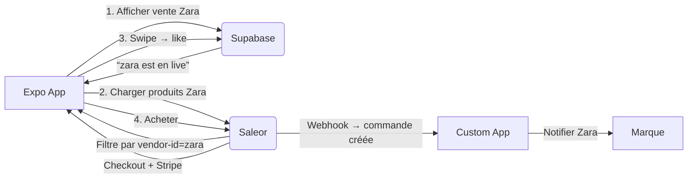

# WAREHOUSE

Dans ton projet, tu veux créer un marketplace multi-marques, où chaque marque = un "warehouse" (même si ce n’est pas un vrai entrepôt physique).

✅ Donc, tu vas créer un warehouse par marque.
✅ Et tu veux que la commande soit attribuée au bon warehouse (marque), pas à un entrepôt aléatoire.


🔍 Explication des 2 options warehouse possible 

1️⃣ Prioritize warehouses by sorting order (coché par défaut)

    “Allocate stock to the first warehouse in the list assigned to this channel. If stock is insufficient, allocate remaining quantity to next warehouse, etc.”

➡️ C’est la stratégie “premier arrivé, premier servi” selon l’ordre de la liste.

✅ Idéal si tu veux contrôler manuellement l’ordre des marques (warehouses).
❌ Mais attention : si tu as plusieurs marques, et que tu veux que chaque produit soit lié à sa propre marque, cette stratégie peut mélanger les stocks si tu ne gères pas bien l’ordre.


# PRODUCT TYPE (configuration > product type)

le "slug" du product type est le meme que "Product Type Name" mais en minuscule :

-> Product Type Name : FashionProduct
-> slug : fashionproduct

On peut le confirmer en faisant cette requete GraphQL : 
https://holy-swipe-dev.eu.saleor.cloud/graphql/
{
  "data": {
    "productType": {
      "id": "UHJvZHVjdFR5cGU6MjU=",
      "name": "FashionProduct",
      "slug": "fashionproduct"
    }
  },
  "extensions": {
    "cost": {
      "requestedQueryCost": 1,
      "maximumAvailable": 50000
    }
  }
}

on va devoir créer un attribut et l'assigner au product type 

# CREATE A NEW ATTRIBUT (configuration >Create New Attribute )

✅ Exemple 1 : Créer vendor_id (type Text)

    C’est la référence externe à la marque (ex: "ecobrand-2026")

🔹 General Information
Champ
	
Valeur à entrer
Default Label
	
Vendor ID (ce qui s’affiche dans le Dashboard)
Attribute Code
	
vendor-id (slug interne — sans espaces, en minuscules, tirets autorisés)
Catalog Input type for Store Owner
	
Textbox (pour un texte libre)

✅ Coche Value Required → si tu veux que ce champ soit obligatoire (recommandé pour vendor_id).

🔹 Properties (à droite)
Option
	
Choix
Product Attribute (radio)
	
✅ coché (car c’est un attribut produit, pas contenu)
Filterable in storefront
	
✅ coché → utile pour filtrer par marque plus tard
Visible in storefront
	
❌ décoché → tu ne veux pas afficher vendor-id aux clients (c’est une donnée technique)
Position in faceted navigation
	
laisse vide (ou met 1 si tu veux qu’il apparaisse en haut des filtres)


# UTILS A SAVOIR 

Pour verifier toutes les actions possible sur l'api : 

Ex: Vérifier les mutations disponibles
{
  __schema {
    mutationType {
      fields {
        name
        args {
          name
          type {
            name
          }
        }
      }
    }
  }
}


# ARCHITECTURE 


Excellente question — et elle touche au **cœur de ton architecture**. Voyons **où Saleor intervient** dans cette stratégie, et **pourquoi c’est toujours le moteur central** de ton marketplace.

---

## ✅ **Saleor reste le CŒUR de ton système** — voici exactement **où et comment** :

### 🔹 1. **Catalogue produits → 100 % Saleor**
- Tous les produits (nom, description, images, prix) sont stockés **dans Saleor**.
- Les **attributs personnalisés** (`vendor_id`, `brand_name`, `eco-friendly`) sont définis **dans Saleor**.
- Tu n’as **aucun produit dans Supabase** → juste des références (`vendor_id`).

✅ *Saleor = source de vérité pour les produits.*

---

### 🔹 2. **Filtrage des produits → 100 % Saleor (GraphQL)**
Quand tu charges `/sale/zara`, tu fais :
```ts
// Requête GraphQL → vers Saleor
products(filter: { attributes: [{ slug: "vendor-id", values: ["zara"] }] })
```
→ C’est **Saleor** qui :
- Lit ses données
- Filtre par attribut
- Retourne les bons produits

✅ *Saleor gère la logique de recherche et de filtrage.*

---

### 🔹 3. **Panier & Checkout → 100 % Saleor**
- Création du panier (`checkoutCreate`)
- Ajout de produits (`checkoutLinesAdd`)
- Paiement (`checkoutPaymentCreate`)
- Finalisation (`checkoutComplete`)
- Commande stockée **dans Saleor**

✅ *Saleor gère tout le parcours d’achat.*

---

### 🔹 4. **Multi-marques → via Saleor (Warehouse + attributs)**
- Chaque marque = **Warehouse** (même si pas d’inventaire réel)
- Attribution des produits à une marque → via **Warehouse + `vendor_id`**
- Tu pourras plus tard **fractionner les commandes par marque** via les **webhooks Saleor**

✅ *Saleor est conçu pour ça (marketplace recipe officielle).*

---

## ❓ Et Supabase, alors ? À quoi sert-il ?

Supabase **n’est pas un concurrent de Saleor** — il est **complémentaire** :

| Fonction | Où ça tourne ? | Rôle |
|--------|----------------|------|
| **Authentification** | Supabase | Gère les comptes utilisateurs, sessions |
| **Préférences utilisateur** | Supabase | Couleurs, tailles, marques aimées |
| **Likes / Swipes** | Supabase | `user_id` + `product_id` (ID Saleor) |
| **Ventes privées actives** | Supabase | `private_sales` = **métadonnées marketing** (est-ce que Zara est en vente *maintenant* ?) |
| **Vendor Portal (backend)** | Supabase (ou autre) | Gestion des marques, sync avec Saleor |

> 🎯 **Supabase = comportement utilisateur + orchestration**  
> **Saleor = catalogue + commande + paiement**

---

## 🔄 Schéma d’interaction simplifié



---

## 🔑 Pourquoi cette séparation est puissante ?

- ✅ **Pas de duplication** : un produit n’existe qu’une fois (dans Saleor)
- ✅ **Pas de lock-in** : si tu changes de storefront, Saleor reste
- ✅ **Évolutif** : tu peux ajouter Algolia, un moteur IA, etc., sans toucher Saleor
- ✅ **Conforme à Saleor** : tu utilises leur modèle marketplace officiel

---

## 🚫 Ce que Saleor ne fait **pas** (et c’est normal) :

- Gérer des **dates de vente privée** (marketing)
- Stocker les **préférences UI** de l’utilisateur
- Gérer des **notifications push**
- Faire du **machine learning**

→ Et c’est **là que Supabase (ou un microservice) intervient**.

---

## ✅ En résumé : Oui, Saleor est **central**

Même si tu utilises Supabase pour `private_sales`, **Saleor reste le moteur** :
- Il fournit les produits
- Il gère le panier
- Il finalise la commande
- Il stocke la vérité métier

Supabase, c’est la **couche comportementale et marketing** autour.

> 💡 C’est exactement l’architecture recommandée pour un **marketplace moderne** :  
> **Headless Commerce (Saleor) + Customer Data Platform (Supabase)**

---

Souhaites-tu que je t’aide à :
1. 🛠️ Créer la table `private_sales` dans Supabase ?
2. 📱 Mettre à jour `HomeScreen` pour charger les ventes depuis Supabase **et les produits depuis Saleor** ?
3. 🔄 Mettre à jour `sale/[id].tsx` pour **filtrer par `vendor_id`** (au lieu du feed global) ?

Dis-moi — on va tout connecter proprement ! 😊
