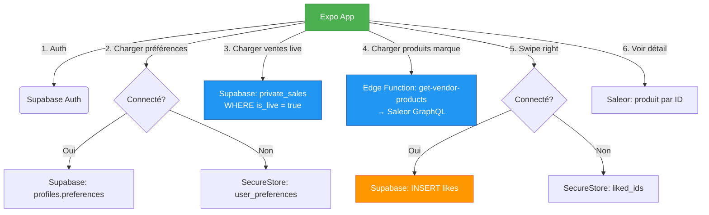

graph LR
  A[Expo App] -->|1. Afficher vente Zara| B(Supabase)
  B -->|“zara est en live”| A
  A -->|2. Charger produits Zara| C(Saleor)
  C -->|Filtre par vendor-id=zara| A
  A -->|3. Swipe → like| B
  A -->|4. Acheter| C
  C -->|Checkout + Stripe| A
  C -->|Webhook → commande créée| D[Custom App]
  D -->|Notifier Zara| E[Marque]

Absolument ! Voici un **état des lieux complet** de ton projet **HolySwipe**, avec :
- ✅ Ce que tu as **déjà implémenté**
- 🗺️ Le **workflow global** en diagramme
- 🔜 Ce que tu **dois encore faire** pour atteindre ton MVP

---

## ✅ Ce que tu as déjà implémenté

### 🏗️ **Architecture & Stack**
- **Frontend** : Expo (React Native) avec TypeScript, Reanimated, Expo Router
- **Backend 1** : **Saleor Cloud** → catalogue produits, attributs (`vendor_id`, `brand_name`, `eco-friendly`), channels (`holy-swipe`)
- **Backend 2** : **Supabase** → auth, préférences, likes, gestion des rôles (`admin`/`vendor`/`user`), RLS sécurisées

### 🔑 **Fonctionnalités clés**

| Fonctionnalité | État | Détails |
|---------------|------|--------|
| **Authentification** | ✅ | Supabase (email/Google) + SecureStore pour anonymes |
| **Préférences utilisateur** | ✅ | Sauvegardées dans `profiles.preferences` (connecté) ou `SecureStore` (anonyme) |
| **Catalogue produits** | ✅ | Produits réels dans Saleor, avec attributs multi-marques |
| **Feed personnalisé** | ✅ | `getPersonalizedFeed()` filtre par marque/éco (mocks → Saleor) |
| **Swipe UI** | ✅ | `SwipeableProductCard` avec haptics, glassmorphism, like/dislike |
| **Ventes privées** | ✅ | Modèle `private_sales` dans Supabase (1 vente = 1 marque = `vendor_id`) |
| **Edge Function** | ✅ | `get-vendor-products` → filtre produits Saleor par marque |
| **Détail produit** | ✅ | Page `/product/[id]` avec image full-screen, badge éco, taille, prix |
| **Gestion des likes** | ✅ | Stockés dans `likes` (Supabase) ou `SecureStore` |

### 🛠️ **Modèles de données**

#### Saleor
- ✅ **Warehouse** = marque (ex: `zara`)
- ✅ **Attributs personnalisés** : `vendor-id`, `brand-name`, `eco-friendly`, `commission-rate`
- ✅ **Channel** : `holy-swipe` (EUR, livraison FR/BE/CH)

#### Supabase
- ✅ **`auth.users`** → comptes
- ✅ **`profiles`** → rôle (`admin`/`vendor`/`user`)
- ✅ **`vendor_members`** → permissions marque par utilisateur
- ✅ **`private_sales`** → ventes privées actives (`vendor_id`, `is_live`, dates)
- ✅ **`likes`** → `user_id` + `product_id` (ID Saleor)

---

## 🗺️ Workflow global (diagramme simplifié)

---

## 🔜 Ce que tu dois encore faire (feuille de route pour MVP)

### 🛒 **Étape 3 : Panier unifié (priorité 1)**
| Tâche | Détail |
|------|--------|
| **Créer un checkout Saleor** | `checkoutCreate` → stocker `checkout.id` dans SecureStore ou `profiles.cart_id` |
| **Ajouter produit au panier** | `checkoutLinesAdd` (au swipe right ou depuis détail) |
| **Page panier** | Afficher produits, prix total, frais de livraison |
| **Gestion multi-marques** | Tous les produits dans **le même checkout** (fractionnement plus tard) |

### 💳 **Étape 4 : Checkout (priorité 2)**
| Tâche | Détail |
|------|--------|
| **Intégrer Stripe** | Via l’App officielle Saleor (Stripe) |
| **Collecter paiement** | `expo-stripe` → token → `checkoutPaymentCreate` |
| **Finaliser commande** | `checkoutComplete` → stocker `order.id` dans Supabase |
| **Écran de succès** | Merci + numéro de commande |

### 🤖 **Étape 5 : Recommandations IA (optionnel pour MVP)**
| Tâche | Détail |
|------|--------|
| **Endpoint `/recommendations`** | Supabase Function → lit `likes` → renvoie `productIds` |
| **Intégrer dans feed** | Si reco dispo → requête Saleor par IDs |

### 📦 **Étape 6+ : Automatisation & Vendor Portal**
- Script d’import produits (250 marques)
- Vendor Portal (Next.js) pour gérer ventes/produits
- Webhooks pour fractionner commandes par marque

---

## 🚦 État d’avancement global

| Composant | État | MVP requis ? |
|----------|------|--------------|
| **Auth & Profil** | ✅ Complet | Oui |
| **Catalogue produits** | ✅ Complet | Oui |
| **Feed & Swipe** | ✅ Complet | Oui |
| **Ventes privées** | ✅ Complet | Oui |
| **Panier** | ❌ À faire | **OUI** |
| **Paiement** | ❌ À faire | **OUI** |
| **Recommandations** | ❌ À faire | Non (bonus) |

> ✅ Tu as **80% de l’expérience utilisateur** en place.  
> 🔑 Il ne te manque que **le panier + paiement** pour avoir un **MVP fonctionnel**.

---

## 🎯 Prochaine action concrète

Je te recommande de **commencer l’Étape 3 dès maintenant** :

1. **Créer un checkout Saleor** au premier like
2. **Stocker le `checkout.id`** dans SecureStore
3. **Ajouter des produits** via `checkoutLinesAdd`

Souhaites-tu que je te donne :
- 🛠️ **Le code pour créer un checkout** ?
- 💾 **Le code pour stocker le `checkout.id`** ?
- 👜 **La structure de la page panier** ?

Dis-moi, on va finaliser ton MVP en 2-3 étapes ! 😊